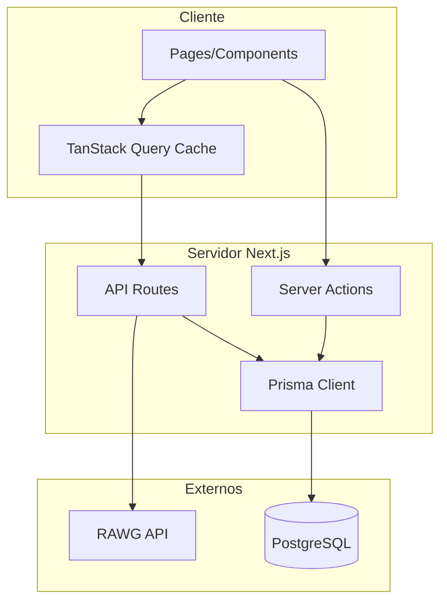
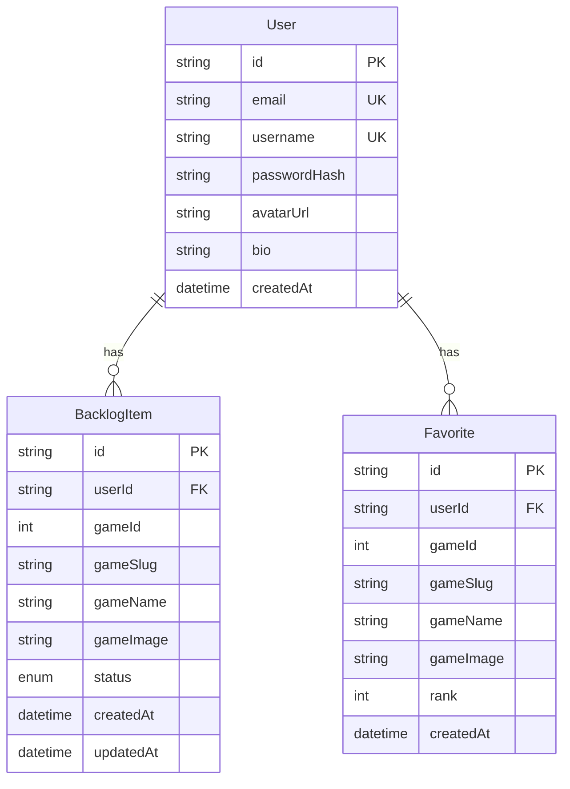

# Gamerboxd MVP - Plano de Desenvolvimento

Aplicacao web para gamers gerenciarem seu backlog de jogos e criarem sua tierlist pessoal de favoritos, inspirado no [redesign do Letterboxd](https://dribbble.com/shots/14830135-Letterboxd-App-Redesign).

## Stack Tecnologico

| Camada | Tecnologia |

|--------|------------|

| Frontend | Next.js 16 (App Router) + React 19 |

| Styling | Tailwind CSS 4 + shadcn/ui |

| Data Fetching | TanStack Query (React Query) |

| API de Jogos | [RAWG API](https://rawg.io/apidocs) |

| ORM | Prisma |

| Banco de Dados | PostgreSQL |

| Autenticacao | NextAuth.js (Credentials Provider) |

## Arquitetura



## Modelo de Dados (Prisma Schema)



**Status do Backlog**: `WANT_TO_PLAY`, `PLAYING`, `COMPLETED`, `DROPPED`, `ON_HOLD`

## Features do MVP

### 1. Autenticacao (Email/Senha)

- Registro de usuario com email, username e senha
- Login/Logout
- Protecao de rotas autenticadas
- Sessao persistente via NextAuth.js

### 2. Busca e Detalhes de Jogos

- Campo de busca com debounce
- Grid de resultados com paginacao infinita
- Pagina de detalhes do jogo (`/games/[slug]`)
- Dados via RAWG API com cache do TanStack Query

### 3. Sistema de Backlog

- Adicionar/remover jogo do backlog
- Alterar status (Want to Play, Playing, Completed, etc.)
- Visualizar backlog pessoal filtrado por status
- Pagina do perfil com lista do backlog

### 4. Tierlist de Favoritos

- Adicionar jogo aos favoritos (max 10)
- Ordenar favoritos por ranking (drag and drop)
- Exibir top 10 no perfil do usuario

## Estrutura de Pastas Proposta

Baseada no padrao do [Josh Comeau](https://www.joshwcomeau.com/react/file-structure/) - organizada por funcao com componentes em pastas proprias e barrel files para imports limpos.

```
src/
├── app/
│   ├── (auth)/
│   │   ├── login/page.tsx
│   │   └── register/page.tsx
│   ├── (main)/
│   │   ├── layout.tsx
│   │   ├── page.tsx
│   │   ├── games/
│   │   │   ├── page.tsx
│   │   │   └── [slug]/page.tsx
│   │   └── profile/
│   │       └── page.tsx
│   ├── api/
│   │   ├── auth/[...nextauth]/route.ts
│   │   └── games/
│   │       ├── route.ts
│   │       └── [slug]/route.ts
│   └── layout.tsx
│
├── components/
│   ├── ui/                          # shadcn components (Button, Card, etc)
│   │
│   ├── GameCard/
│   │   ├── GameCard.tsx             # Componente principal
│   │   ├── GameCard.types.ts        # Types especificos
│   │   └── index.ts                 # Barrel: export { default } from './GameCard'
│   │
│   ├── GameGrid/
│   │   ├── GameGrid.tsx
│   │   ├── GameGridSkeleton.tsx     # Sub-componente de loading
│   │   └── index.ts
│   │
│   ├── SearchBar/
│   │   ├── SearchBar.tsx
│   │   ├── SearchBar.helpers.ts     # Funcoes auxiliares (debounce, etc)
│   │   ├── use-search.ts            # Hook especifico do componente
│   │   └── index.ts
│   │
│   ├── BacklogButton/
│   │   ├── BacklogButton.tsx
│   │   ├── StatusDropdown.tsx       # Sub-componente
│   │   └── index.ts
│   │
│   ├── FavoriteButton/
│   │   ├── FavoriteButton.tsx
│   │   └── index.ts
│   │
│   ├── FavoritesList/
│   │   ├── FavoritesList.tsx
│   │   ├── FavoriteItem.tsx         # Sub-componente
│   │   ├── FavoritesList.helpers.ts # Logica de reordenacao
│   │   └── index.ts
│   │
│   ├── Navbar/
│   │   ├── Navbar.tsx
│   │   ├── UserMenu.tsx             # Sub-componente
│   │   └── index.ts
│   │
│   └── GameDetails/
│       ├── GameDetails.tsx
│       ├── GameDetails.types.ts
│       ├── GameScreenshots.tsx      # Sub-componente
│       ├── GameInfo.tsx             # Sub-componente
│       └── index.ts
│
├── hooks/                           # Hooks reutilizaveis globais
│   ├── use-games.ts                 # TanStack Query hooks para RAWG
│   ├── use-backlog.ts               # Mutations e queries do backlog
│   ├── use-favorites.ts             # Mutations e queries dos favoritos
│   └── use-debounce.ts              # Utility hook
│
├── helpers/                         # Funcoes auxiliares globais
│   ├── rawg.helpers.ts              # Transformacoes de dados RAWG
│   └── date.helpers.ts              # Formatacao de datas
│
├── lib/
│   ├── prisma.ts                    # Prisma client singleton
│   ├── auth.ts                      # NextAuth config
│   └── rawg.ts                      # RAWG API client
│
├── actions/                         # Server Actions
│   ├── backlog.ts
│   ├── favorites.ts
│   └── auth.ts
│
├── providers/
│   └── QueryProvider.tsx            # TanStack Query Provider
│
├── types/                           # Types globais (ja existe)
│   ├── game.types.ts
│   ├── user.types.ts
│   └── index.ts
│
├── constants.ts                     # Constantes globais (ja existe)
└── utils.ts                         # Utility functions (ja existe)
```

### Padrao de Componentes (Josh Comeau Style)

Cada componente complexo tem sua propria pasta com:

- `ComponentName.tsx` - componente principal
- `index.ts` - barrel file para imports limpos
- `ComponentName.types.ts` - tipos especificos (opcional)
- `ComponentName.helpers.ts` - funcoes auxiliares (opcional)
- `use-*.ts` - hooks especificos do componente (opcional)
- Sub-componentes no mesmo diretorio

**Exemplo de barrel file (`index.ts`):**

```typescript
export * from './GameCard';
export { default } from './GameCard';
```

**Imports ficam limpos:**

```typescript
// Ao inves de:
import GameCard from '@/components/GameCard/GameCard';

// Usamos:
import GameCard from '@/components/GameCard';
```

### Bundle Aliases

Configurar no `tsconfig.json`:

```json
{
  "compilerOptions": {
    "paths": {
      "@/*": ["./src/*"]
    }
  }
}
```

## Paginas e Rotas

| Rota | Descricao | Auth |

|------|-----------|------|

| `/` | Landing page | Nao |

| `/login` | Tela de login | Nao |

| `/register` | Tela de registro | Nao |

| `/games` | Busca de jogos | Nao |

| `/games/[slug]` | Detalhes do jogo | Nao |

| `/profile` | Backlog e favoritos do usuario | Sim |

## Design (Inspiracao Letterboxd Redesign)

Referencia visual: [Letterboxd App Redesign - Dribbble](https://dribbble.com/shots/14830135-Letterboxd-App-Redesign)

### Principios de Design

- **Tema escuro** como padrao - fundo escuro (#0d0d0f ou similar) com elementos em tons de cinza
- **Cards com poster em destaque** - imagem do jogo como elemento principal
- **Glassmorphism sutil** - blur e transparencia em modais e overlays
- **Hover effects** - mostrar acoes rapidas (add backlog, favoritar) ao passar mouse
- **Gradientes sutis** - para destaque de elementos importantes
- **Sombras profundas** - criar sensacao de profundidade e camadas

### Cores

- Background: `#0d0d0f` (quase preto)
- Surface: `#1a1a1d` (cards e containers)
- Border: `#2a2a2d` (bordas sutis)
- Primary: `#6366f1` (indigo - acoes principais)
- Accent: `#22c55e` (verde - sucesso/completed)
- Status colors: conforme [`constants.ts`](src/constants.ts)

### Tipografia

- Titulos: **Space Grotesk** ou **Plus Jakarta Sans** (moderna, bold)
- Corpo: **Inter** (legibilidade)
- Monospace: **JetBrains Mono** (stats, numeros)

### Componentes Visuais

- **Game Cards**: Poster vertical com overlay gradiente, rating badge, hover para acoes
- **Profile Header**: Avatar grande, stats em destaque, tierlist horizontal
- **Search**: Input com icone, resultados em grid responsivo
- **Navbar**: Minimalista, logo + busca + avatar do usuario

## Dependencias a Instalar

```bash
# Core
npm install @tanstack/react-query next-auth @auth/prisma-adapter
npm install prisma @prisma/client bcryptjs
npm install -D @types/bcryptjs

# UI extras (shadcn components)
npx shadcn@latest add avatar dropdown-menu skeleton tabs badge dialog
```

## Ordem de Implementacao

1. Setup do Prisma + PostgreSQL
2. Configurar NextAuth.js com Credentials
3. Criar API routes para RAWG
4. Setup TanStack Query Provider
5. Implementar busca de jogos
6. Criar pagina de detalhes do jogo
7. Implementar sistema de backlog
8. Implementar tierlist de favoritos
9. Criar pagina de perfil
10. Polimento visual (dark theme, animacoes)

---

## Referencias

- **Design**: [Letterboxd App Redesign - Dribbble](https://dribbble.com/shots/14830135-Letterboxd-App-Redesign)
- **Estrutura de Arquivos**: [Delightful React File/Directory Structure - Josh Comeau](https://www.joshwcomeau.com/react/file-structure/)
- **API de Jogos**: [RAWG Video Games Database API](https://rawg.io/apidocs)
- **TanStack Query**: [TanStack Query Docs](https://tanstack.com/query/latest)
- **NextAuth.js**: [NextAuth.js Docs](https://next-auth.js.org/)
- **Prisma**: [Prisma Docs](https://www.prisma.io/docs)