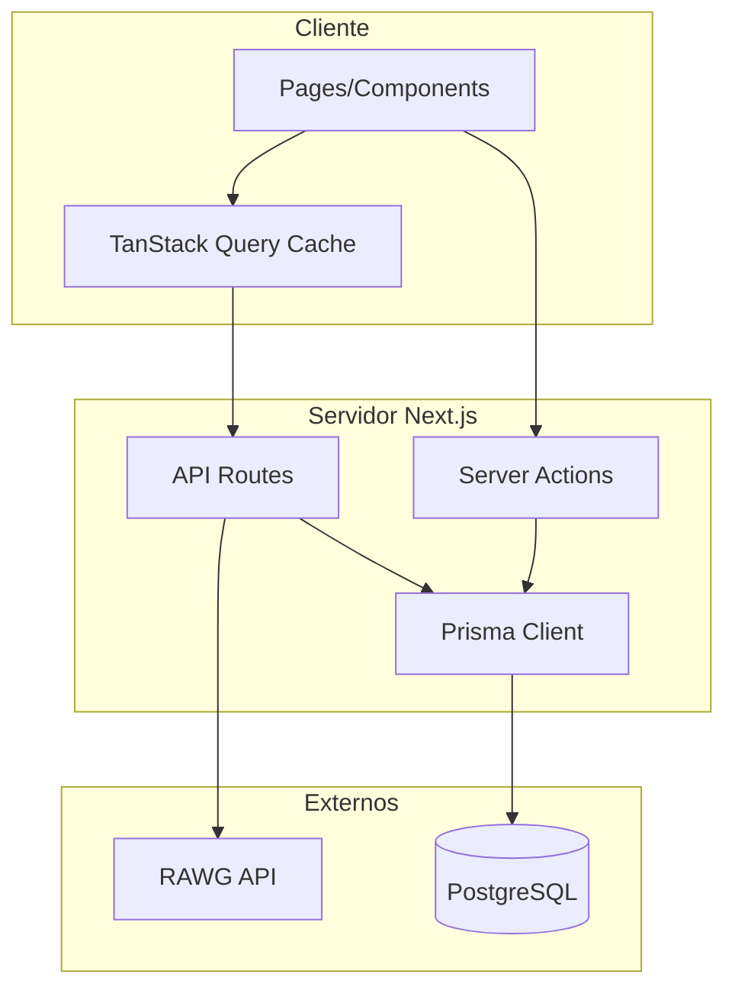

# Gamerboxd MVP - Plano de Desenvolvimento

Aplicacao web para gamers gerenciarem seu backlog de jogos e criarem sua tierlist pessoal de favoritos, inspirado no [redesign do Letterboxd](https://dribbble.com/shots/14830135-Letterboxd-App-Redesign).

## Status do Projeto

✅ **MVP Fase 1 Completa** - O projeto está funcional com todas as features core implementadas.

### Features Implementadas

- [x] Autenticação com email/senha (NextAuth.js)
- [x] Busca de jogos com debounce (RAWG API)
- [x] Página de detalhes do jogo
- [x] Sistema de backlog com 5 status
- [x] Tierlist de favoritos (ranking 1-10)
- [x] Página de perfil com tabs
- [x] Dark theme com visual polish
- [x] Animações e transições de página (Motion)
- [x] Botões com transições suaves

## Stack Tecnológico

| Camada | Tecnologia |

|--------|------------|

| Frontend | Next.js 16 (App Router) + React 19 |

| Styling | Tailwind CSS 4 + shadcn/ui |

| Data Fetching | TanStack Query (React Query) |

| Animations | Motion (Framer Motion) |

| API de Jogos | [RAWG API](https://rawg.io/apidocs) |

| ORM | Prisma 7 |

| Banco de Dados | PostgreSQL (Docker) |

| Autenticação | NextAuth.js (Credentials Provider) |

## Arquitetura

## Próximos Passos Recomendados

### Fase 2: Melhorias de UX (Prioridade Alta)

1. **Drag & Drop nos Favoritos** - Usar `@dnd-kit/core` para reordenar rankings
2. **Infinite Scroll** - Carregar mais jogos conforme scroll na busca
3. **Filtros de Busca** - Filtrar por plataforma, gênero e ano de lançamento
4. **Optimistic Updates** - Feedback instantâneo nos botões de ação

### Fase 3: Reviews e Ratings (Prioridade Média)

1. **Sistema de Ratings** - Avaliação 1-5 estrelas para jogos
2. **Reviews** - Textos de review com data
3. **Estatísticas** - Média de ratings, número de reviews

### Fase 4: Social (Prioridade Baixa)

1. **Perfis Públicos** - Rota `/u/[username]`
2. **Sistema de Follow** - Seguir outros usuários
3. **Activity Feed** - Ver atividades de quem você segue
4. **Listas Personalizadas** - Criar e compartilhar listas

### Fase 5: Infraestrutura (Quando Necessário)

1. **Verificação de Email** - Confirmar email no registro
2. **Reset de Senha** - Recuperar acesso à conta
3. **PWA** - Instalar como app no celular
4. **Analytics** - Tracking de uso

## Documentação

- 📊 [Modelo de Dados](docs/DATABASE.md) - Estrutura das tabelas e relacionamentos
- 🔐 Autenticação usa bcryptjs para hash de senhas
- 🎮 RAWG API key configurada via `RAWG_API_KEY` no `.env`

## Design (Inspiração Letterboxd Redesign)

Referência visual: [Letterboxd App Redesign - Dribbble](https://dribbble.com/shots/14830135-Letterboxd-App-Redesign)

### Cores do Tema

- Background: `#0d0d0f` (quase preto)
- Surface: `#1a1a1d` (cards e containers)
- Border: `#2a2a2d` / `white/10` (bordas sutis)
- Primary: `#6366f1` (indigo - ações principais)
- Accent: `#22c55e` (verde - sucesso/completed)

### Tipografia

- Fonte principal: **Inter** (sistema)
- Monospace: **JetBrains Mono** (stats, números)

## Referências

- **Design**: [Letterboxd App Redesign - Dribbble](https://dribbble.com/shots/14830135-Letterboxd-App-Redesign)
- **Estrutura de Arquivos**: [Delightful React File/Directory Structure - Josh Comeau](https://www.joshwcomeau.com/react/file-structure/)
- **API de Jogos**: [RAWG Video Games Database API](https://rawg.io/apidocs)
- **TanStack Query**: [TanStack Query Docs](https://tanstack.com/query/latest)
- **NextAuth.js**: [NextAuth.js Docs](https://next-auth.js.org/)
- **Prisma**: [Prisma Docs](https://www.prisma.io/docs)
- **Motion**: [Motion Docs](https://motion.dev/)